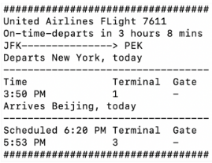
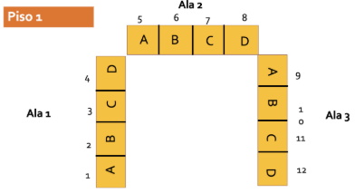
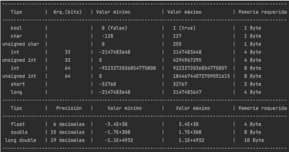
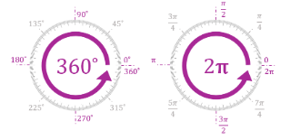

# Exercises C/C++
## Operadores
### Area y Volumen de una esfera
El siguiente programa permite hallar el Area y el Volumen de una esfera.
`PI=3.1415`
```
A=4*(PI)*(r)^2
V = (4/3)*(PI)*(r)^3
```
### Ticket
Desarrolle un programa en C++, que permita imprimir la informacion tal y como se muestra en la siguiente imagen:

### Empaquetar paquetes de colores
Tai Loy, ha decidido empaquetar en sus bodegas colores, en cajas de 6, 12 y 24 unidades. De tal manera que reducirá sus costos al ser ellos mismos quienes realicen el empaque de colores.

Se pide realizar un programa que capture como dato de entrada un número entero que representaría la cantidad de colores a ser empaquetados y el programa halle el menor número de cajas de colores de 24, 12 , 6 e indicar el número de colores sobrantes
```
Ejemplo1:
Si se ingresa 104 el programa indicara que se necesitara:
4 cajas de 24 colores
0 cajas de 12 colores
1 caja de 6 colores
2 colores sobrarian
```

```
Ejemplo2:
Si se ingresa 498 el programa indicara que se necesitara:
20 cajas de 24 colores
1 caja de 12 colores
1 caja de 6 colores
0 colores sobrarian
```
### Distribucion de habitaciones
El hotel "Colca In", tiene 84 habitaciones, distribuidas en 7 pisos. Cada piso tiene 3 Alas y en cada Ala hay 4 habitaciones numeradas con las letras A, B, C y D. De tal manera que por cada piso el hotel tiene 12 habitaciones. Tal y como se puede apreciar en la figura:


Escriba un programa que permita ingresar un numero entre 1 y 84, e indique a que piso, que ala y que habitacion corresponde.
El usuario siempre debe ingresar un numero entre 1 y 84.
```
numero: 1
piso: 1
ala: 1
habitacion: A
```
```
numero: 13
piso: 2
ala: 1
habitacion: A
```
```
numero: 7
piso: 1
ala: 2
habitacion: C
```
```
numero: 84
piso: 7
ala: 3
habitacion: D
```
### Parte entera y fraccionaria de un float
Realiza un programa que permita leer un numero float y el programa imprima en una linea la parte entera del numero y en la linea siguiente la parte fraccionaria del numero.
```
Ingresa un float: 14.8765
Parte entera: 14
Parte fraccionaria: 0.8765
```

### 
Realiza un programa que genere una variable a, cuyo valor es el tamano de una variable booleana. Haga lo mismo para los tipos short, int, long, float, double, char. Encuentre la forma adecuada de evaluar el tamano de un string.
```
Ingresa un booleano: 0
Tamano del booleano es 1
```

### 7
Desarrolle un programa C++, que permita imprimir la informacion de tipos de variables en C++:

### Fahrenheit to Celsius
En el siguiente programa se desea convertir grados Fahrenheit a grados Celsius.

La formula para convertir entre grados de estos dos tipos de escala de temperaturas es:
```
C/5 = (F-32)/9
```
En la solucion que se muestra a continuacion, hay un error de logica. Podrias encontrar el error?
### Radians to Grades
Escriba un codigo que transforme un numero en radianes a un numero en grados sexagesimales.

Recuerde que pi radianes equivale a 180 grados sexagesimales, donde pi=3.14159

### Three floats numbers
Realiza un programa que permita leer tres números float y el programa calcule un nuevo número cuya parte entera es igual a la parte entera de la suma de los dos primeros y la parte fraccionaria es la parte fraccionaria de la suma del segundo y tercer número.

El resultado debe imprimirse con una precisión de 2 decimales.
```
Ingresa un primer float : 14.87
Ingresa un segundo float: 2.1231 
Ingresa un tercer float : 9.324 
Nuevo número: 16.45
```
```
Ingresa un primer float : 5.6
Ingresa un segundo float: 3.7 
Ingresa un tercer float : 4.8
Nuevo número: 9.5
```
### Consumo de electricidad
Escriba un código que calcule el consumo de electricidad en soles dado el consumo en kW, con las siguientes condiciones:
- Si el consumo es menor o igual a 100 kW, el kW cuesta 0.4522 Soles
- Si el consumo es mayor que 100 kW, se aplica la tarifa anterior hasta 100 kW y 0.7 Soles por kW para el consumo sobre 100 kW

### Distancia entre dos puntos
Escriba un codigo que calcule la distancia entre dos puntos. Los puntos tienen las coordenadas (x1,y1) y (x2,y2); y la distancia está dada por la fórmula:
```
Distancia = ((x2-x1)^2+(y2-y1)^2)^(1/2)
```
### Suma de dos angulos
Escriba un codigo que calcule la suma de dos angulos. El usuario debe ingresar los angulos en grados, minutos y segundos.

El codigo debe imprimir los angulos y el resultado.

### Ángulo entre las manecillas de un reloj
Implemente un programa en C++ que, dado un tiempo expresado en formato de 24 horas
(hh:mm), calcule y muestre el ángulo más pequeño (en grados) formado entre la manecilla de las
horas y la manecilla de los minutos en un reloj analógico de 12 horas.

Para el ingrese de la hora y minutos puede utilizar el siguiente código:

```
int horas, minutos;
char separador;
cout << "Formato hh:mm";
cin >> horas >> separador >> minutos;
```
Ejemplos:
```
Input: 5:30
Output: 15°
```
```
Input: 9:50
Output: 5°
```
```
Input: 21:00
Output: 90°
```
```
Input: 12:00
Output: 0°
```


## Estructuras de control
### Ex
Desarrollar un código que lea dos números enteros, identifique si el numero ingresado es par o impar y divida el primero entre el segundo. Si el número es cero debe señalar que el cociente no está definido
### Ex
Escribir un programa que permita leer un número entero que podría tener los valores 1, 2, 3 ó 4, e imprima la estación de año que le corresponda según la tabla :

1 Otoño 2 Invierno 3 Primavera 4 Verano Ahora cambie los enteros por char, con las opciones ‘p’, ‘v’, ‘o’, ‘i’

### Ángulo entre las manecillas de un reloj
Implemente un programa en C++ que, dado un tiempo expresado en formato
de 24 horas (hh:mm), calcule y muestre el ángulo más pequeño (en grados)
formado entre la manecilla de las horas y la manecilla de los minutos en
un reloj analógico de 12 horas.

Para el ingrese de la hora y minutos puede utilizar el siguiente código:

```
int horas, minutos;
char separador;
cout << "Formato hh:mm";
cin >> horas >> separador >> minutos;
```

Test:
```
Input: 5:30
Output: 15°
```
```
Input: 9:50
Output: 5°
```
```
Input: 21:00
Output: 90°
```
```
Input: 12:00
Output: 0°
```

