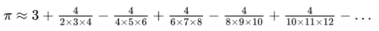

# Exercises
## E1
Realice un programa, que permita leer varios números enteros hasta que se
introduzca el cero.

Luego el programa mostrará lo siguiente:
- La cantidad de números leídos.
- La cantidad de números pares.
- La cantidad de números impares.
El cero, no debe entrar en el conteo.

## E2
Realice un programa que permita leer un número entero de al menos 3 dígitos,
dato que se debe validar, luego el programa indicará:
- La cantidad total de dígitos
- La cantidad de dígitos pares
- La cantidad de dígitos impares

## E3
El valor de PI puede ser aproximadamente la siguiente serie infinita:

Escribir un programa que muestre 60 aproximaciones de PI. La primera
aproximación debe de usar solo el primer término de la serie cada aproximación
debe incluir un nuevo término.
Observando la lista de aproximaciones podría deducir en qué aproximación se
estabiliza el valor de PI.
